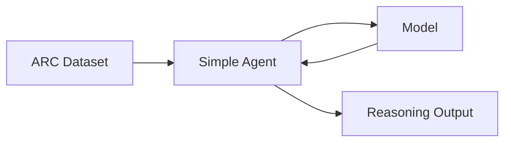

# System Patterns

## System architecture

The current architecture involves a simple agent that interacts with a model. The agent is responsible for preparing the input for the model based on the dataset.

## Key technical decisions

*   The agent is implemented in Python.
*   The agent uses a system prompt to guide the model's response.
*   Placeholder for model integration is included.

## Design patterns in use

*   Basic modular design with a dedicated agent class.

## Component relationships

*   The `SimpleAgent` depends on a `Model` instance.
*   The agent processes data from the ARC dataset.
