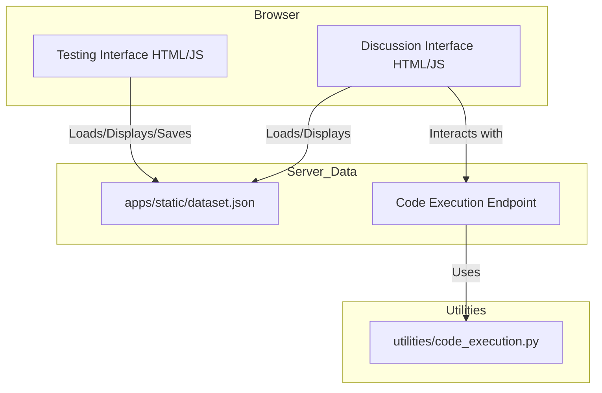
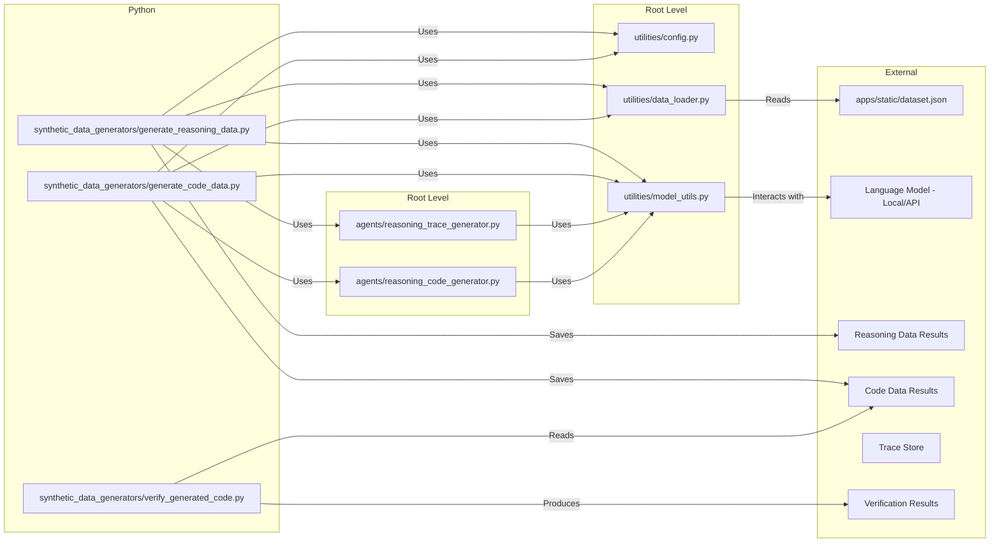
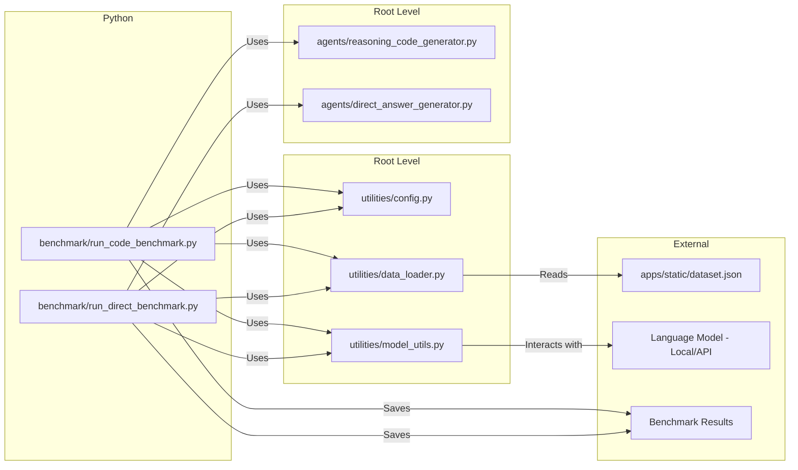

# System Patterns

## System architecture

The project encompasses three main architectural components:

**Synthetic Data Creation Interfaces**

* Two client-side web applications allow users to interact with ARC tasks:
  * The testing interface (`apps/testing_interface.html`) for task solving and synthetic data creation
  * The discussion interface (`apps/discuss_interface.html`) for AI-assisted task analysis and discussion, including a Python code execution environment
* User actions in the testing interface (solving, transforming, adding traces) generate new data stored in `apps/static/dataset.json`
* The discussion interface interacts with a server-side endpoint (`/arc2/execute_code`) for executing Python code in a sandbox environment

**Synthetic Data Generation & Verification**

* Two Python-based command-line applications orchestrate the synthetic data generation:
  * `synthetic_data_generators/generate_reasoning_data.py`: Generates reasoning traces using `agents/reasoning_trace_generator.py`
  * `synthetic_data_generators/generate_code_data.py`: Generates both reasoning and Python code using `agents/reasoning_code_generator.py`
* A third script handles code verification:
  * `synthetic_data_generators/verify_generated_code.py`: Executes generated Python code against task test cases
* Shared utility components handle configuration, data loading, and model interaction
* Both data generation scripts implement concurrency control, periodic saving, and graceful exit handling

**LLM Benchmarking**

* Two Python scripts handle different benchmarking approaches:
  * `benchmark/run_code_benchmark.py`: Evaluates models on generating Python code solutions
  * `benchmark/run_direct_benchmark.py`: Evaluates models on directly generating grid answers
* Both scripts handle task loading, model interaction, result evaluation, and detailed reporting

## Key technical decisions

* **Synthetic Data Creation**: Client-side JavaScript for UI interactions and data manipulation. JSON for data storage.
* **Synthetic Data Generation**: 
  * Python for backend/scripting logic
  * Asynchronous programming (`asyncio`) for efficient model interaction
  * Concurrency control (`asyncio.Semaphore`) in data generation scripts
  * Modular design separating concerns (config, data, model, agents, generators, verifiers)
  * Command-line argument parsing for runtime configuration
  * Signal handling (`signal`, `atexit`) for graceful shutdown and result saving
  * Global state management for accumulating results across async tasks
* **LLM Benchmarking**: 
  * Python for scripting logic
  * Asynchronous model interaction
  * Configurable via command-line arguments
  * Support for "best-of" approach to generate multiple solutions per task

## Design patterns in use

* **Synthetic Data Creation**: Event-driven UI
* **Synthetic Data Generation**: 
  * Modular design
  * Configuration management pattern (config file + CLI overrides)
  * Factory pattern in `utilities/model_utils.py` (`get_model`)
  * Concurrency limiting pattern (`asyncio.Semaphore`)
  * Graceful shutdown/resource cleanup pattern
* **LLM Benchmarking**: 
  * Runner pattern within benchmark scripts
  * Configuration management pattern
  * Factory pattern from utilities

## Component relationships

* **Synthetic Data Creation**: UI depends on ARC data format, primarily interacting with `apps/static/dataset.json`. Data storage format defined in `data/nature_of_data.md`.
* **Synthetic Data Generation**:
  * Data generation scripts orchestrate the process using agents, utilities, and configuration.
  * Scripts depend on `utilities/config.py` for settings and use `utilities/data_loader.py` which defaults to loading tasks from `apps/static/dataset.json` (path configurable via CLI).
  * Agents implement distinct prompting strategies but rely on `utilities/model_utils.py` for API interaction.
  * Auxiliary utilities process output from data generation scripts and update storage.
* **LLM Benchmarking**:
  * Benchmark scripts orchestrate the evaluation process.
  * Scripts use `utilities/data_loader.py` to load tasks (defaulting to `apps/static/dataset.json`, path configurable via CLI, and supporting filtering via `--task_ids`).
  * Scripts use `utilities/model_utils.py` to interact with models
  * Scripts implement their own logic for code execution and evaluation
