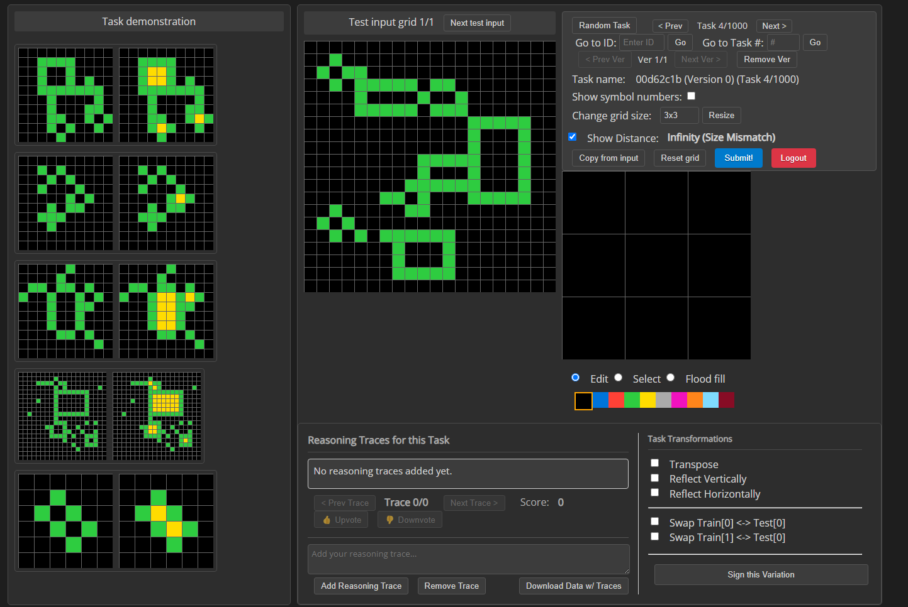

# ARC-AGI-2: Synthetic Data Generation & Benchmarking

This repository is a modified version of the original [Abstraction and Reasoning Corpus (ARC-AGI-2)](https://github.com/fchollet/arc-agi), adapted to focus on the **collective creation of synthetic data** and **benchmarking of language models** for advancing Artificial General Intelligence research.

*"ARC can be seen as a general artificial intelligence benchmark, as a program synthesis benchmark, or as a psychometric intelligence test. It is targeted at both humans and artificially intelligent systems that aim at emulating a human-like form of general fluid intelligence."*

A foundational description of the original dataset, its goals, and its underlying logic, can be found in: [On the Measure of Intelligence](https://arxiv.org/abs/1911.01547) and the [ARC-AGI-2 Presentation](https://docs.google.com/presentation/d/1hQrGh5YI6MK3PalQYSQs4CQERrYBQZue8PBLjjHIMgI/edit?usp=sharing).

## Project Overview

This project has three main phases:

1. **Synthetic Data Generation Interface (Phase 1)**: Adapting the original ARC-AGI interface to facilitate the collective creation of synthetic data.
2. **Synthetic Data Generation & Verification (Phase 2)**: Developing tools for generating synthetic data, including reasoning traces and code solutions, from language models.
3. **Real Benchmarking (Phase 3)**: Creating a dedicated benchmarking suite to evaluate language model performance directly on ARC tasks.

## Phase 1: Synthetic Data Generation Interface

The initial phase of this project focused on adapting the original ARC-AGI interface to facilitate the **collective creation of synthetic data**. The goal was to generate richer data capturing not just solutions, but also the reasoning process and task variations.

Key features developed during this phase include:

*   **Testing Interface (`apps/testing_interface.html`):** A web-based UI for solving ARC tasks.
*   **Task Transformations:** Tools within the interface to apply transformations (reflection, rotation, etc.) to tasks, generating variations.
*   **Reasoning Traces:** Functionality for users to add step-by-step explanations for their solutions.
*   **Distance Metric:** UI feedback indicating the closeness of an attempted solution to the target.
*   **Data Structure:** Defined in `data/nature_of_data.md`, tracking task versions and contributions.

This phase established the foundation for working with ARC tasks and exploring methods beyond simple solution finding.

## Focus: Collective Synthetic Data Generation

While leveraging the core ARC tasks, this interface introduces new features specifically designed to facilitate the generation of rich, structured synthetic data. This data aims to capture not just the solutions to reasoning problems, but also the process and variations involved.

Data generation occurs primarily in two ways:

1.  **Task Transformations:** Users can apply various transformations (e.g., reflection, rotation, swapping train/test pairs) to existing tasks. This allows exploring the logical consistency of the underlying reasoning patterns and generating task variations automatically.
2.  **Reasoning Traces:** Users can explicitly add step-by-step reasoning traces to explain how they arrive at a solution for a given task. This provides valuable meta-data about the problem-solving process itself.

A key addition to the UI is the **Distance Metric**, which provides feedback on how far the current attempt is from the target solution, offering guidance during the solving process.

## Dataset Composition

The repository retains the original ARC-AGI-2 dataset structure:

-   `data/training`: Contains 1,000 tasks for demonstrating the format and core concepts.
-   `data/evaluation`: Contains 120 public evaluation tasks.

These tasks serve as the foundation upon which new synthetic data (transformations, reasoning traces) is built. See `data/nature_of_data.md` for details on the JSON structure and metadata used, including how task versions and contributions are tracked.

## Usage of the Testing Interface

You can use the testing interface located at `apps/testing_interface.html`. Open it in a web browser (Chrome recommended). It will prompt you to select a task JSON file or load the combined `dataset.json`.

The modified interface includes tools for both solving tasks and generating synthetic data:



Key sections of the interface:

-   **Task Demonstration:** Shows the input/output pairs demonstrating the task's logic.
-   **Test Input Grid:** Displays the current test input to be solved.
-   **Output Grid & Controls:** Allows users to construct the output grid using editing tools (Edit, Select, Flood fill), resize, copy from input, and reset.
    -   **Show Distance:** This checkbox toggles the display of the distance metric, indicating how close the current output attempt is to the solution.
-   **Reasoning Traces:** A dedicated section for adding, viewing, and removing step-by-step reasoning explanations for the current task. Users can upvote/downvote traces and download task data enriched with these traces.
-   **Task Transformations:** Allows applying predefined transformations (Transpose, Reflect, Swap Train/Test) to the current task, creating variations. Users can "Sign" these variations, contributing them to the dataset.

### Answer Validation

Click the "Submit!" button to check your answer for the current test input. After solving, you can move to the next test input or load a new task.

### Data Contribution

By adding reasoning traces or signing transformed task variations, users collectively contribute to building a richer, more informative dataset for AGI research.

## Phase 2: Synthetic Data Generation & Verification

This phase includes a suite of scripts designed to generate synthetic reasoning and code data using language models, and to verify the generated code against ARC tasks.

### Functionality

The suite works as follows:

1.  **Data Loading:** Scripts load ARC tasks either from individual files (`data/training/`, `data/evaluation/`) or the combined `data/dataset.json` (default).
2.  **Reasoning Data Generation (`synthetic_data_generators/generate_reasoning_data.py`):**
    *   Uses `agents/reasoning_trace_generator.py` to interact with a configured language model.
    *   Presents 'train' examples to the model.
    *   Prompts the model to explain its reasoning process for deriving outputs from inputs.
    *   Saves the generated reasoning (along with metadata and prompts) to timestamped JSON files in `synthetic_data_generators/synthetic_data/reasoning_data/`.
    *   Supports concurrency, periodic saving, and graceful exit.
    *   Appends new results to a single JSONL file for easier processing. The saving mechanism has been updated to ensure all results are captured correctly even when running concurrent tasks.
3.  **Code Data Generation (`synthetic_data_generators/generate_code_data.py`):**
    *   Uses `agents/reasoning_code_generator.py` to interact with a configured language model.
    *   Presents 'train' examples to the model.
    *   Prompts the model to provide both reasoning and a Python function (`solve_task`) that implements the task logic.
    *   Saves the reasoning, generated code, metadata, and prompts to timestamped JSON files in `synthetic_data_generators/synthetic_data/code_data/`.
    *   Supports concurrency, periodic saving, and graceful exit.
    *   Appends new results to a single JSONL file for easier processing.
4.  **Code Verification (`synthetic_data_generators/verify_generated_code.py`):**
    *   Reads a code data results file (generated by `generate_code_data.py`).
    *   For each task result, it executes the generated `solve_task` function against the task's test cases (embedded within the results file).
    *   Logs the success or failure for each test case.
5.  **Auxiliary Utilities:**
    *   `auxiliary_utilities/merge_reasoning.py`: Merges reasoning data results into `data/traces_store.json`.
    *   Handles both list-based and string-based reasoning formats for backward compatibility.
    *   Supports JSONL files (detecting by file extension).

This allows for systematic generation of reasoning and code data, and evaluation of the generated code's correctness.

### Configuration

Model selection (local vs. OpenRouter, specific model names), data source (`dataset.json` vs individual files), concurrency limits, and other parameters (temperature, API keys) are configured in `utilities/config.py`. Command-line arguments can override these defaults. Ensure your `.env` file contains the necessary API keys (e.g., `OPENROUTER_API_KEY`) if using external models, or that your local model server is running.

### Running the Scripts

Execute the following commands from the project's root directory:

**1. Generate Reasoning Data:**
```bash
# Example: Generate reasoning for 15 tasks using GEMINI_FLASH with concurrency 3
python synthetic_data_generators/generate_reasoning_data.py --model_identifier GEMINI_FLASH --max_tasks 15 --max_concurrent_tasks 3
```

**2. Generate Code Data:**
```bash
# Example: Generate code for 10 tasks using GEMINI_FLASH with concurrency 3
python synthetic_data_generators/generate_code_data.py --model_identifier GEMINI_FLASH --max_tasks 10 --max_concurrent_tasks 3
```

**3. Verify Generated Code:**
```bash
# Example: Verify code from a specific results file
python synthetic_data_generators/verify_generated_code.py --results_file synthetic_data_generators/synthetic_data/code_data/code_data_results_YYYYMMDD_HHMMSS.json
```
(Replace `YYYYMMDD_HHMMSS` with the actual timestamp of your results file). Check `synthetic_data_generators/synthetic_data/code_verification.log` for detailed output.

**4. Merge Reasoning Data:**
```bash
# Example: Merge reasoning data into traces_store.json
python auxiliary_utilities/merge_reasoning.py --input_file synthetic_data_generators/synthetic_data/reasoning_data/reasoning_data_results_YYYYMMDD_HHMMSS.json
```

## Phase 3: Real Benchmarking

This phase focuses on directly benchmarking language model performance on ARC tasks. It includes a dedicated benchmarking script that handles both generating model responses and evaluating their correctness.

### Functionality

The benchmarking suite works as follows:

1. **Task Loading:** The script loads ARC tasks from `data/dataset.json` (default).
2. **Model Interaction:** It interacts with a configured language model to generate Python code for solving each task.
3. **Code Verification:** It executes the generated code against the task's test cases to determine if the model's solution is correct.
4. **Results Tracking:** It tracks success/failure statistics and saves detailed results.
5. **Multiple Responses:** It supports generating multiple responses for each task using the `--best_of` flag.

Key features include:
* Concurrency control using `asyncio.Semaphore`
* Periodic and final result saving. The saving mechanism has been updated to ensure all results are captured correctly even when running concurrent tasks.
* Detailed logging
* Signal handling for graceful shutdown
* Consistent data structure with all responses stored as lists

### Running the Benchmark

Execute the following command from the project's root directory:

```bash
# Example: Benchmark a model on 10 tasks with 3 responses per task
python benchmark/run_code_benchmark.py --model_identifier GEMINI_FLASH --max_tasks 10 --max_concurrent_tasks 3 --best_of 3
```

Check `benchmark/benchmark_logs/code_benchmark_run.log` for detailed output and `benchmark/benchmark_results/code_benchmark/code_benchmark_results.jsonl` for the results.
